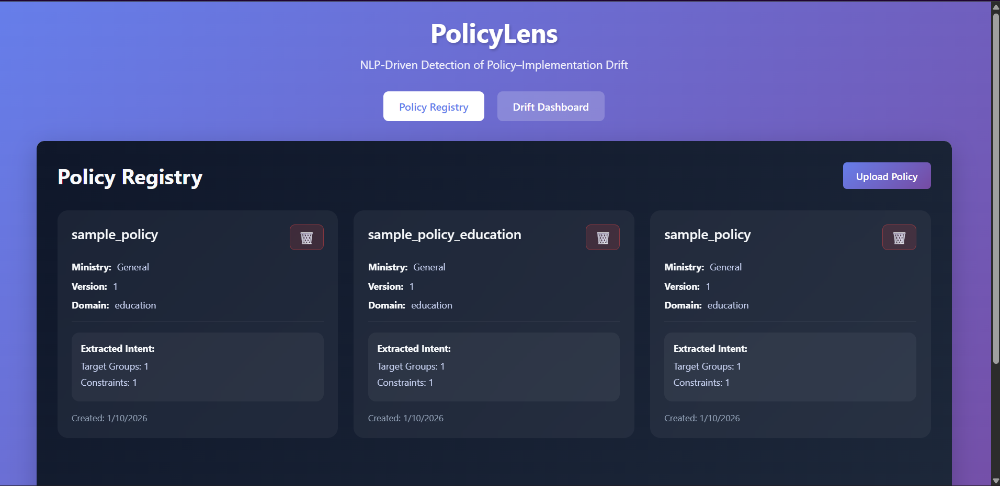
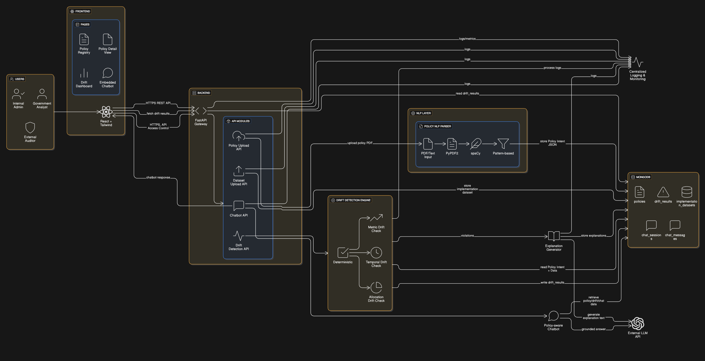

# 🏛️ PolicyLens



Live On - https://policy-drift-frontend.vercel.app/

### NLP-Driven Detection of Policy–Implementation Drift

**PolicyLens** is an evolution of our Round-1 project **“Automated Detection of Policy–Implementation Drift in Government Schemes.”**
While the first iteration focused on **rule-based drift detection using structured inputs (JSON + CSV)**, PolicyLens extends this idea into a **scalable, web-based GovTech platform** that extracts **policy intent directly from unstructured policy documents (PDFs)** using NLP.

---

## 📌 Background & Evolution (Round-1 → Round-2)

### 🔹 Round-1

* Command-line tool
* Policy intent provided as structured JSON
* Rule-based drift detection
* Terminal-based reports

### 🔹 Round-2 (PolicyLens)

* Full web-based system
* NLP-driven policy intent extraction from PDFs
* Multi-policy support
* Interactive dashboards
* Persistent database (MongoDB)
* Policy-aware chatbot for explanations

**Core idea remains the same:** detecting misalignment between **policy intent** and **implementation** —
the system has evolved in **scale, usability, and realism**.

---

## 🎯 Problem Statement

Government policies are written in **natural language**, while implementation data exists as **structured datasets**.
This gap makes it difficult to systematically verify whether implementation aligns with policy intent.

**PolicyLens addresses this by:**

* Extracting policy intent from documents using NLP
* Converting intent into machine-checkable constraints
* Comparing intent against real implementation data
* Detecting and explaining policy–implementation drift

---

## 🧠 Core Design Principle

> **NLP understands policy language.
> Rule-based logic makes compliance decisions.
> LLMs explain results — they do not decide them.**

This ensures:

* **Determinism**
* **Explainability**
* **Auditability** (critical for governance systems)

---

## 🏗️ System Architecture Overview

PolicyLens follows a **modular, layered architecture**.

### Main Components

* **Frontend:** React + Tailwind dashboard
* **Backend:** FastAPI API Gateway
* **NLP Layer:** Policy parsing & intent extraction
* **Rule Engine:** Deterministic drift detection
* **Database:** MongoDB (system memory)
* **LLM Services:** Explanations & chatbot (RAG-based)
* **Logging & Monitoring:** Centralized system logs

📌 See `Architecture.png` for the full system diagram.

---

## 🧩 How the System Works

### 1️⃣ Policy Upload & NLP Parsing

* User uploads a policy PDF
* Text extracted using **PyPDF2**
* NLP engine (**spaCy + rule patterns**) extracts:

  * Target groups
  * Numeric thresholds
  * Temporal commitments
* Output: **Structured Policy Intent JSON**
* Stored in **MongoDB**

---

### 2️⃣ Implementation Data Upload

* District-level CSV files uploaded
* Stored in MongoDB
* Explicitly linked to a policy

---

### 3️⃣ Rule-Based Drift Detection

The Drift Detection Engine compares:

* Policy Intent JSON
* Implementation Data

**Detected drift types:**

* **Metric Drift** (threshold violations)
* **Temporal Drift** (instability over time)
* **Allocation Drift** (resource under-use / misuse)

> All decisions are **rule-based**, not predictive.

---

### 4️⃣ Explanation Generation

* LLM generates **human-readable explanations**
* LLM **does not determine violations**
* Explanations are grounded in stored facts

---

### 5️⃣ Policy-Aware Chatbot (RAG)

* Users query the system in natural language
* Chatbot retrieves:

  * Policy intent
  * Drift results
* Generates **grounded, explainable answers**

---

## 🧠 NLP vs Rule-Based Responsibilities

| Stage                      | NLP / Models | Rule-Based Logic |
| -------------------------- | ------------ | ---------------- |
| Read policy PDF            | ❌            | ❌                |
| Understand policy language | ✅            | ❌                |
| Extract constraints        | ✅            | ❌                |
| Detect violations          | ❌            | ✅                |
| Assign severity            | ❌            | ✅                |
| Generate explanations      | ✅            | ❌                |

---

## 🗄️ Database Design (MongoDB)

### Collections

* `policies`
* `implementation_datasets`
* `drift_results`
* `chat_sessions`
* `chat_messages`

MongoDB enables **flexible storage** for varying policy structures.

---

## 🎨 Frontend Features

### Pages

* **Policy Registry** – manage multiple policies
* **Policy Detail View** – visualize extracted intent
* **Drift Dashboard** – summaries, charts, filters
* **Embedded Chatbot** – policy-aware assistant

**Design focus:**

* GovTech-style UI
* Explainability
* Clear traceability from **policy → data → violation**

---

## 📈 Scalability & Reliability

PolicyLens is designed to scale:

* Stateless FastAPI backend
* Horizontal scaling supported
* Asynchronous processing for heavy tasks
* MongoDB for growing data volumes
* Modular services (NLP, drift engine, chatbot)

---

## 🛠️ Tech Stack

* **Frontend:** React, Tailwind CSS, Recharts
* **Backend:** FastAPI, Python
* **Database:** MongoDB
* **NLP:** spaCy, PyPDF2
* **LLM:** External API (model-agnostic)
* **Deployment:** Cloud-agnostic

---

## 👥 Team Contributions

| Team Member     | Contribution                         |
| -----------     | ----------------------------------   |
| Gaurav Singh    | NLP policy parser backend & Research |
| Priyanshu Pant  | System architecture & backend APIs   |
| Ritik Bhandari  | Frontened + Backend                  |
| Parth Verma     | Frontend UI & RAG Implementation     |

Github Management - Gaurav Singh
---

## 🚀 Running the Project (Summary)

```bash
# Backend
cd backend
pip install -r requirements.txt
uvicorn main:app --reload
```

```bash
# Frontend
cd frontend
npm install
npm run dev
```

---

## 🏁 Final Note

**PolicyLens transforms a rule-based prototype into a realistic, deployable GovTech system while preserving determinism and explainability.**

> This project is **not** about predicting policy failures —
> it is about **transparently verifying policy compliance**.

---

